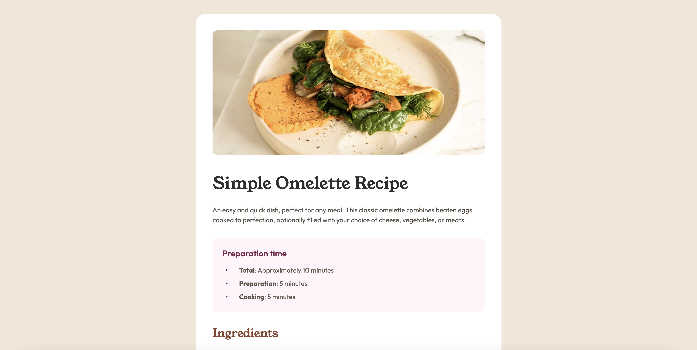

# Frontend Mentor - Recipe page solution

This is a solution to the [Recipe page challenge on Frontend Mentor](https://www.frontendmentor.io/challenges/recipe-page-KiTsR8QQKm). Frontend Mentor challenges help you improve your coding skills by building realistic projects. 

## Table of contents

- [Overview](#overview)
  - [The challenge](#the-challenge)
  - [Screenshot](#screenshot)
  - [Links](#links)
- [My process](#my-process)
  - [Built with](#built-with)
  - [Continued development](#continued-development)
- [Author](#author)

## Overview

### Screenshot

### Links

- [Solution URL](https://www.frontendmentor.io/solutions/responsive-recipe-page-FOln0JoAMv)
- [Live Site URL](https://anonymouscoder323.github.io/recipe-page-main/)

## My process

### Built with

- Semantic HTML5 markup
- CSS custom properties
- Flexbox
- CSS Grid
- Mobile-first workflow

### Continued development

I want to learn how to better organize my code. I specifically want to learn how to better organize the different typography styles.

## Author

- Website - [Anonymous Coder](https://www.anonymouscoder.com)
- Frontend Mentor - [@AnonymousCoder323](https://www.frontendmentor.io/profile/AnonymousCoder323)
